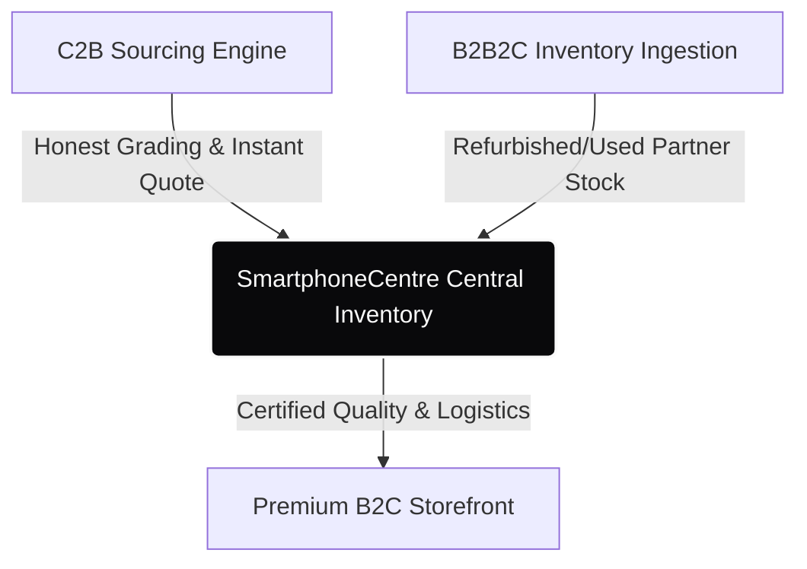
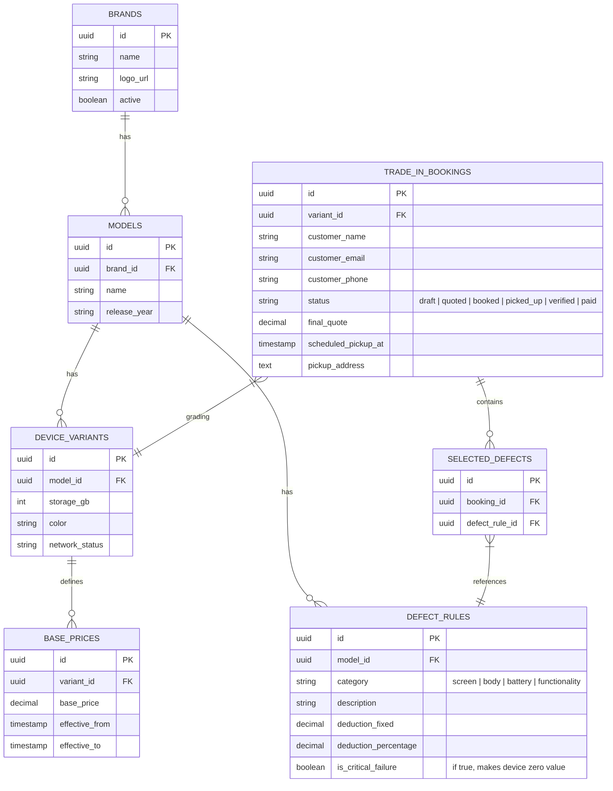

# Project SmartphoneCentre: PRD & System Design Architecture

This document establishes the Product Requirements Document (PRD) and System Design Architecture for **SmartphoneCentre**, a disruptive, premium device trade-in and resale marketplace ecosystem operating a white-labeled hybrid inventory model.

---

## 1. Executive Summary & Business Ecosystem

SmartphoneCentre bridges the gap between high-volume commercial supply and consumer convenience, structured across three key pillars:



1. **C2B Sourcing Engine (Current Focus):** A direct-to-consumer digital self-diagnostic wizard. Consumers grade their devices honestly, get an instantaneous dynamically calculated valuation quote, and book a seamless doorstep agent pickup.
2. **B2B2C Ingestion (The Blind Marketplace):** Local retail storefronts list refurbished/used inventory under strict grading tiers via a secure portal.
3. **Premium B2C Storefront:** A masked marketplace (similar to Apple Certified Refurbished) where we own the end-to-end customer experience, trust stamp, quality gates, short-term warranties, and fulfillment.

---

## 2. Visual Specification & Design System
We reject generic SaaS templates. The design language is **Industrial Luxury & Spatial Tactility** (reminiscent of Leica, Apple, and Teenage Engineering).

### 2.1 Design Tokens
- **Base Color Space:**
  - `Stark Alabaster` (`#FAFAFA` / `#FFFFFF`) - Core background and canvas
  - `Industrial Cobalt` (`#1D4ED8` / `#0A2540`) - Brand color, premium interactive states, and active cards
  - `Deep Ink Navy` (`#0F172A`) - Primary typography for maximum contrast
  - `Slate Blue & Ice` (`#64748B` / `#F0F4F8`) - Subtle details, secondary copy, and container backgrounds
- **Borders & Shadows:** 1px crisp micro-borders (`border-slate-200` / `border-blue-100`). Real-world glassmorphic drop shadows for elegant layering on white backgrounds.
- **Typography:** Bold, clean, asymmetrical, and highly editorial layouts. Massive elegant headers (e.g., Outfit, Inter, or Space Grotesk) coupled with hyper-readable metadata.
- **Motion:** Heavy implementation of Framer Motion (layoutId transitions) for smooth element stretching and spatial shifting.

---

## 3. Product Requirements Document (PRD)

### 3.1 C2B Diagnostic Wizard Flow
The diagnostic wizard must guide users through device identification, condition grading, price estimation, and pickup scheduling.

#### Core Features:
- **Device Selector:** Search/drill down by Brand -> Model -> Storage capacity -> Carrier/Network.
- **Diagnostic Steps:**
  - *Power & Boot:* Does the device turn on and function?
  - *Screen & Body:* Scratches, cracks, dents, screen burn-in.
  - *Functional Checks:* Camera, FaceID/TouchID, Speakers, Wi-Fi/Bluetooth, Battery health (approximate).
- **Dynamic Valuation Screen:** Shows real-time quote recalculations with breakdown of deductions.
- **Doorstep Booking:** Integrated date/time picker, address collection, and pickup agent assignments.

---

## 4. Valuation Engine Architecture

Valuation calculation rejects flat-rate deductions. It utilizes a base-to-defect pricing formula unique to each model variant.

### 4.1 The Valuation Formula
$$\text{Price}_{\text{Final}} = \text{Price}_{\text{Base}} - \sum \left( \text{Deduction}_{\text{Fixed}} + \left( \text{Price}_{\text{Base}} \times \text{Deduction}_{\text{Percentage}} \right) \right)$$

Where:
- $\text{Price}_{\text{Base}}$: The market baseline price for a brand-new or mint condition of the specific model and storage tier.
- $\text{Deduction}_{\text{Fixed}}$: A fixed cash penalty for a specific defect (e.g., missing box: ₹1,500).
- $\text{Deduction}_{\text{Percentage}}$: A percentage-based penalty on the base value (e.g., cracked screen: 25% of base price).

---

## 5. System Design & Data Model

### 5.1 Database Schema (PostgreSQL)



### 5.2 Dynamic Valuation API
- **Endpoint:** `POST /api/valuation/calculate`
- **Payload:**
  ```json
  {
    "variant_id": "uuid-here",
    "selected_defect_ids": [
      "defect-uuid-1",
      "defect-uuid-2"
    ]
  }
  ```
- **Response:**
  ```json
  {
    "base_price": 65000.00,
    "deductions": [
      {
        "description": "Cracked Screen",
        "fixed": 0.00,
        "percentage": 0.25,
        "total_deducted": 16250.00
      },
      {
        "description": "Missing Original Box",
        "fixed": 1500.00,
        "percentage": 0.00,
        "total_deducted": 1500.00
      }
    ],
    "final_price": 47250.00
  }
  ```

---

## 6. Sourcing Wizard Interactive States

To support **Industrial Luxury & Spatial Tactility**, the diagnostic interface transitions through physical card deck movements:

```
+-------------------------------------------------------------+
|  SmartphoneCentre                                           |
+-------------------------------------------------------------+
|                                                             |
|  [ iPhone 15 Pro ]                                          |
|                                                             |
|  Screen Condition:                                          |
|  +--------------------+  +--------------------+             |
|  | [ ] Flawless       |  | [X] Light Scratches|             |
|  | No micro-abrasions |  | Minor surface wear |             |
|  +--------------------+  +--------------------+             |
|  | [ ] Cracked        |  | [ ] Heavy Scratches|             |
|  | Deep cracks / chips|  | Deep grooved lines |             |
|  +--------------------+  +--------------------+             |
|                                                             |
|  ---------------------------------------------------------  |
|  Est. Value: ₹58,000.00                    [ Continue -> ]   |
+-------------------------------------------------------------+
```

### 6.1 State Flow
1. **Device Selection Stage:** Minimal search input with dynamic autocomplete. Upon model selection, a high-fidelity 3D-like product card morphs from the search bar (using Framer Motion's `layoutId`).
2. **Defect Checklist Stage:** As defects are toggled, the "Est. Value" counter at the bottom counts down smoothly using an animated counter.
3. **Summary & Pickup Stage:** Shows the final quote side-by-side with the dynamic pickup scheduling calendar.
